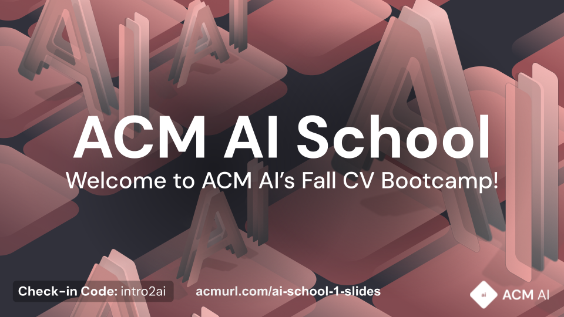

{/*
    If you have any questions about this template, feel free to ask
    your Director for help!
*/}


{/*
    SECTION: Header
    ---------
    Request new headers from you Director to fit your workshop!
*/}

{/*

*/}

The official ACM AI **CV, Data Preprocessing, and Python Introduction** repository. Here you can find the slides and notebook for the workshop. Feel free to go through it yourself!

{/*
    SECTION: Table of Contents
    ---------
    Mandatory Sections:
        - File Directory Structure
        - Workshop Recording
            - if you recorded your workshop, please make it available here
        - Getting Started
            - Give an interesting description of your workshop!
            - E.g. you can use the marketing descriptiong (w/o the emojis
              and make the nouns general ('you' becomes 'the reader'))
        - Resources
            - Images, papers, etc
    Do NOT Include:
        - Author Info
            - This should only be in the main README for your series
    Other Possible Sections:
        - Anything else you'd like, but try not to be redundant!
            - Make sure it's not already in the main series README or
              another section
*/}

{/*
    SECTION: Workshop Video
    ---------
    Most, if not all, workshops should have recordings. Once the recording
    is posted to the ACMUCSD YT channel (https://www.youtube.com/channel/UCyjPATFqc3FwOiuqJ2UG1Eg), replace the text with an  element.
*/}


# 1. Workshop Recording

If you have any questions, feel free to ask in out [ACM AI Discord](https://discord.gg/SZA2WV36sJ); we're happy to help!

[](https://www.youtube.com/watch?v=uqZRqe8MbF0)

{/*
    SECTION: File Directory Structure
    ---------
    Write out your File Directory Structure below (make sure it's up-to-date)
*/}

# 2. File Directory Structure

```bash
workshop-1
    | -- figures
        | -- ai_school_1.png
    | -- presentation-resources
        | -- slides_ai_school_1.pptx
    | -- ai_school_1_wiki.ipynb
    | -- README.md
    | -- slides_ai_school_1.pdf

```

{/*
    SECTION: Getting Started
    ---------
    Brief description of your workshop here
*/}

# 3. Getting Started

We'll kick things off with a brief introduction to AI and Python before diving into the fascinating world of computer vision. You will also hands-on experience working on a data preprocessing project!

You can find the workshop resources here:
- [Presentation](./slides_ai_school_1.pdf)
- [Jupyter Notebook](./ai_school_1_wiki.ipynb)
- [Solutions Collab](https://acmurl.com/aischool1-solution)

{/*
    Note: The above list will depend on your specific workshop.
*/}
